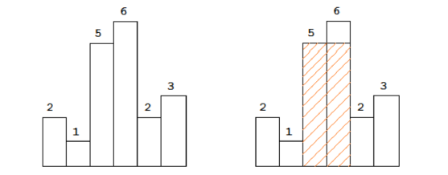

# 一、地址

- GitHub：https://github.com/lamborghini1993/ACMTopic

# 二、题目：直方图求最大矩阵面积


直方图最大矩阵面积法：

给定n个非负整数，表示直方图的方柱的高度，同时，每个方柱的宽度假定都为1，找出直方图中最大的矩形面积。

如：给定高度为：2，1，5，6，2，3，最大面积为10.



# 三、解题思路：

- 用栈维护一个递增的序列，栈中存对应高度的位置。

- 每遍历一个元素，判断是否是栈中最大的元素，如果不是，把栈顶的元素弹出，并计算以栈顶元素为最大值高度时的长方形面积。

- 面积的长度为栈顶元素之前的一个元素到当前遍历的元素的之间的长度。

# 四、代码

```c++
#include <iostream>
#include <stack>
#include <algorithm>
#include <cstring>
#include <vector>
using namespace std;


int LargestRectangleArea(vector<int> &height)
{
    height.push_back(0);//为了统计，数组最后添加0，确保原数组的最后一位得到计算
    stack<int> s;
    int LargestArea = 0;
    int temp, i = 0;
    while(i < height.size())
    {
        if(s.empty() || (height[i] > height[s.top()]))
        {
            s.push(i);
            i++;
        }
        else
        {
            temp = s.top();
            s.pop();
            LargestArea = max(LargestArea, height[temp] * (s.empty() ? i : i - s.top() - 1));
        }
    }
    return LargestArea;
}
int main()
{
    int a[] = {2,1,5,6,2,3};
    vector<int> height(a, a + sizeof(a) / sizeof(int));
    cout << LargestRectangleArea(height) << endl;
    return 0;
}

```

